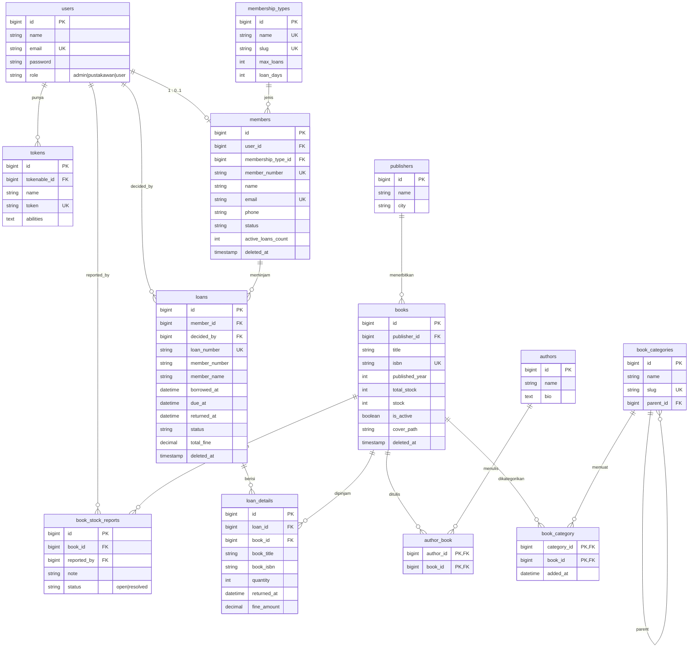

# ERD Sistem Perpustakaan Digital

```mermaid
erDiagram
    users ||--o{ tokens : "punya"
    users ||--o| members : "1 : 0..1"
    users ||--o{ loans : "decided_by"
    users ||--o{ book_stock_reports : "reported_by"
    membership_types ||--o{ members : "jenis"
    members ||--o{ loans : "meminjam"
    loans ||--o{ loan_details : "berisi"
    books ||--o{ loan_details : "dipinjam"
    publishers ||--o{ books : "menerbitkan"
    books ||--o{ book_stock_reports : "dilaporkan"
    books ||--o{ author_book : "ditulis"
    authors ||--o{ author_book : "menulis"
    books ||--o{ book_category : "dikategorikan"
    book_categories ||--o{ book_category : "memuat"
    book_categories ||--o{ book_categories : "parent"

    users {
        bigint id PK
        string name
        string email UK
        string password
        string role "admin|pustakawan|user"
    }
    tokens {
        bigint id PK
        bigint tokenable_id FK
        string name
        string token UK
        text abilities
    }
    membership_types {
        bigint id PK
        string name UK
        string slug UK
        int max_loans
        int loan_days
    }
    members {
        bigint id PK
        bigint user_id FK
        bigint membership_type_id FK
        string member_number UK
        string name
        string email UK
        string phone
        string status
        int active_loans_count
        timestamp deleted_at
    }
    loans {
        bigint id PK
        bigint member_id FK
        bigint decided_by FK
        string loan_number UK
        string member_number
        string member_name
        datetime borrowed_at
        datetime due_at
        datetime returned_at
        string status
        decimal total_fine
        timestamp deleted_at
    }
    loan_details {
        bigint id PK
        bigint loan_id FK
        bigint book_id FK
        string book_title
        string book_isbn
        int quantity
        datetime returned_at
        decimal fine_amount
    }
    publishers {
        bigint id PK
        string name
        string city
    }
    books {
        bigint id PK
        bigint publisher_id FK
        string title
        string isbn UK
        int published_year
        int total_stock
        int stock
        boolean is_active
        string cover_path
        timestamp deleted_at
    }
    authors {
        bigint id PK
        string name
        text bio
    }
    book_categories {
        bigint id PK
        string name
        string slug UK
        bigint parent_id FK
    }
    author_book {
        bigint author_id PK, FK
        bigint book_id PK, FK
    }
    book_category {
        bigint category_id PK, FK
        bigint book_id PK, FK
        datetime added_at
    }
    book_stock_reports {
        bigint id PK
        bigint book_id FK
        bigint reported_by FK
        string note
        string status "open|resolved"
    }
```
